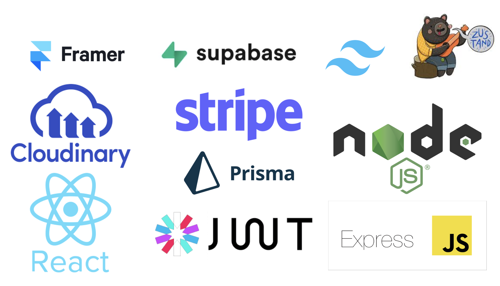
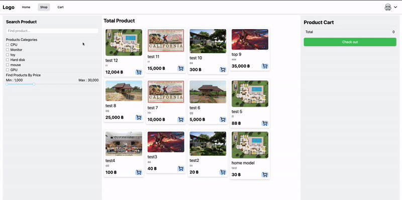

# PMall - Ecommerce Project(React JS)

## Introduction

This project is an e-commerce website designed to support two user roles: user and admin.

### Main Features for Users:

- Users can log in and register on the website.
- They can view, search, and filter products based on text, price, and category.
- Users can add products to their cart and complete the checkout process using Stripe payment integration.
- Users can view their purchase history, including details of past orders.

### Main Features for Admins:

- Admins can add new product categories to the website.
- They can manage the product inventory by adding new products.
- Admins have the ability to manage users on the platform (enable/disable user accounts).
- They can also oversee and manage customer orders.

## Tool I used

- Front-end: React
- Back-end: Node.js with Express.js
- Database: Supabase (online PostgreSQL database)
- ORM: Prisma
- Authentication & Authorization: JWT (token management for login - authorization)
- Media Management: Cloudinary (for photo uploading)
- State Management: Zustand (global state management)
- Styling: Tailwind CSS (for UI design and decoration)
- UI Animation: Framer (for smooth transitions and animations)
- Payment Integration: Stripe
- Date & Time Management: Moment.js

## Feature

## Acknowledgment

This project could not have been completed without the guidance and support of **AJ Tam** and the valuable tutorials on his [รอยไถ พัฒนา](https://www.youtube.com/@roitai-dev)
